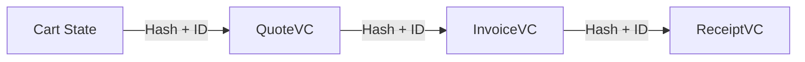

# Cryptographic Audit Trail Implementation Plan (Fastlane Commerce)

This document outlines the tasks required to implement a blockchain-style audit trail for the `Quote` -> `Invoice` -> `Receipt` flow. This ensures that every receipt can be cryptographically traced back to the original Quote and Cart, providing a seamless audit trail for products and accounting.

## Core Concept
Each Verifiable Credential (VC) in the chain must reference the **ID** and **SHA-256 Hash** of its predecessor. This creates an immutable chain of custody.



## 1. Schema Definitions Update
We need to formalize the schema properties for these credentials.

- [ ] **QuoteVC**
    - Add `cartId` (Unique cart identifier)
    - Add `cartHash` (SHA-256 of the cart items JSON)
    - Add `requestId` (Correlation ID)

- [ ] **InvoiceVC**
    - Add `quoteId` (Reference to the QuoteVC)
    - Add `quoteHash` (SHA-256 of the QuoteVC JWT) - *Optional if Quote unavailable, fall back to Cart Hash*
    - Add `previousRecordHash` (Generic field for chain walking)

- [ ] **ReceiptVC** (PaymentReceiptCredential)
    - Add `invoiceId` (Reference to the InvoiceVC)
    - Add `invoiceHash` (SHA-256 of the InvoiceVC JWT)
    - Add `previousRecordHash` (Generic field for chain walking)
    - Add `cartId` (For direct lookup)

## 2. Implementation Tasks

### A. Quote Issuance (`WhatsAppPayloadController.issueQuoteVC`)
- [ ] Calculate `cartHash` during issuance:
  ```typescript
  const cartHash = crypto.createHash('sha256').update(cart.items).digest('hex');
  ```
- [ ] Include `cartHash` in the `QuoteVC` claims.
- [ ] Store the issued `quoteId` in the `carts` table (add column `quote_id` if missing) to link state.

### B. Invoice Issuance (`WhatsAppPayloadController.checkout`)
- [ ] Retrieve the linked `QuoteVC` (or Quote ID) if it exists.
- [ ] If `skipQuote` is false, require a Quote ID.
- [ ] Calculate `quoteHash` or `cartHash`.
- [ ] Include `previousRecordHash` (Quote Hash) and `quoteId` in `InvoiceVC` claims.
- [ ] Store `invoiceId` and `invoiceToken` in `ack_payments` or `carts` table.

### C. Receipt Issuance (`EcoCashWebhookController.handleEcoCashWebhook`)
- [ ] Retrieve the `InvoiceVC` associated with the payment (via `payment.provider_ref` or `cart_id`).
- [ ] Calculate `invoiceHash`.
- [ ] Include `previousRecordHash` (Invoice Hash) and `invoiceId` in `ReceiptVC` claims.

## 3. Database Updates
- [ ] Create migration to add tracking columns:
    ```sql
    ALTER TABLE carts ADD COLUMN quote_id TEXT;
    ALTER TABLE ack_payments ADD COLUMN invoice_id TEXT;
    ALTER TABLE ack_payments ADD COLUMN invoice_hash TEXT;
    ```

## 4. Verification & Audit Tools
- [ ] Create `AuditService` in `src/services/AuditService.ts`.
- [ ] Implement `verifyChain(receiptJwt: string)`:
    1. Decode ReceiptVC.
    2. Extract `invoiceId` and `invoiceHash`.
    3. Fetch InvoiceVC (from repository or Verifier).
    4. Verify InvoiceVC hash matches.
    5. Extract `quoteId` and `quoteHash`.
    6. Verify QuoteVC hash matches.
    - Result: `boolean` (Chain intact).

## 5. UI Updates (Portal)
- [ ] Add "View Audit Trail" button on Receipt view.
- [ ] Visualize the chain (Quote -> Invoice -> Receipt) with verification status ticks.
